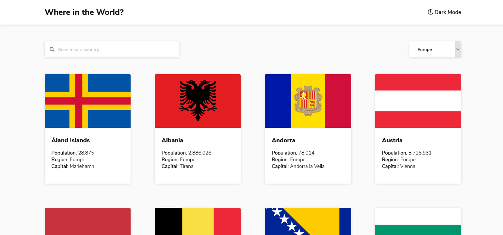
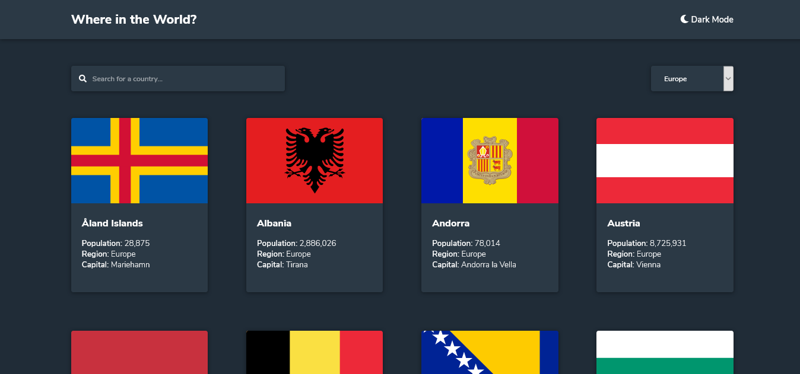
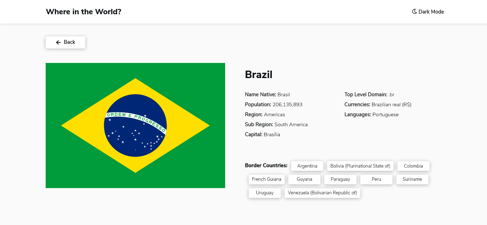
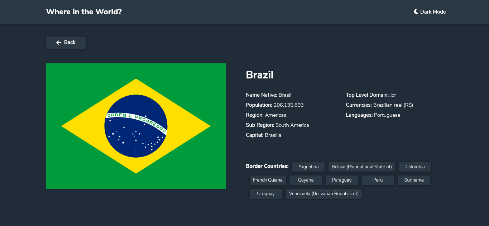
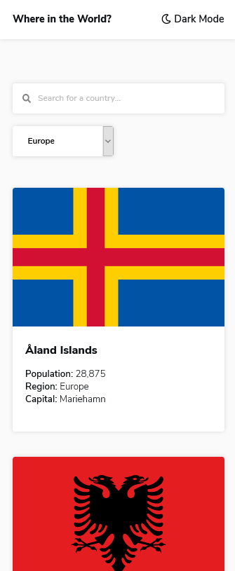
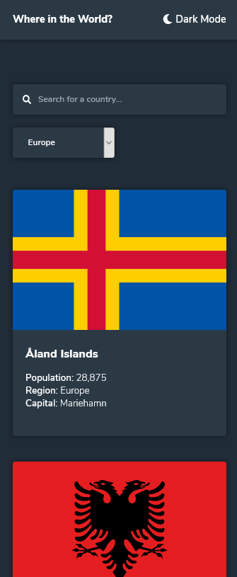
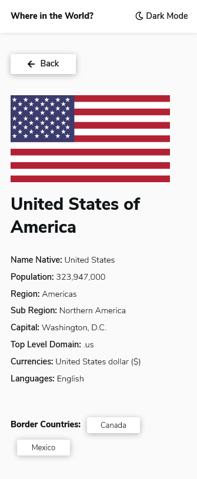
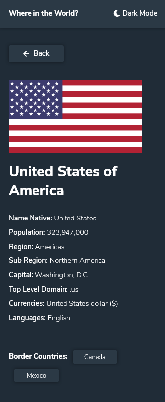

# Frontend Mentor - REST Countries API with color theme switcher

Esta é uma solução para o desafio [REST Countries API with color theme switcher](https://www.frontendmentor.io/challenges/rest-countries-api-with-color-theme-switcher-5cacc469fec04111f7b848ca) Os desafios do Frontend Mentor ajudam você a melhorar suas habilidades de codificação ao construir projetos realistas.

## Índice

- [Visão geral](#visão-geral)
  - [O desafio](#o-desafio)
  - [Screenshot](#screenshot)
  - [Links](#links)
- [Processo](#processo)
  - [Construído com](#construído-com)
- [Autor](#autor)

## Visão geral

### O desafio

Os usuários devem ser capazes de:

- Veja todos os países da API na página inicial
- Pesquise um país usando um campo `input`
- Filtrar países por região
- Clique em um país para ver informações mais detalhadas em uma página separada
- Clique nos países fronteiriços na página de detalhes
- Alternar o esquema de cores entre o modo claro e escuro _(opcional)_

### Screenshot

### Links

- URL do site ao vivo: [Link](https://julioalves-dev.github.io/rest-countries-api-with-color-theme-switcher-master/)

## Processo

### Construído com

- HTML5
- CSS3
- JavaScript

## Autor

- Frontend Mentor - [@JulioAlves-Dev](https://www.frontendmentor.io/profile/JulioAlves-Dev)
- Twitter - [@JulioAlv35](https://twitter.com/JulioAlv35)
- Linkedin - [Julio Alves](https://www.linkedin.com/in/julio-alves-0119b01a6/)
